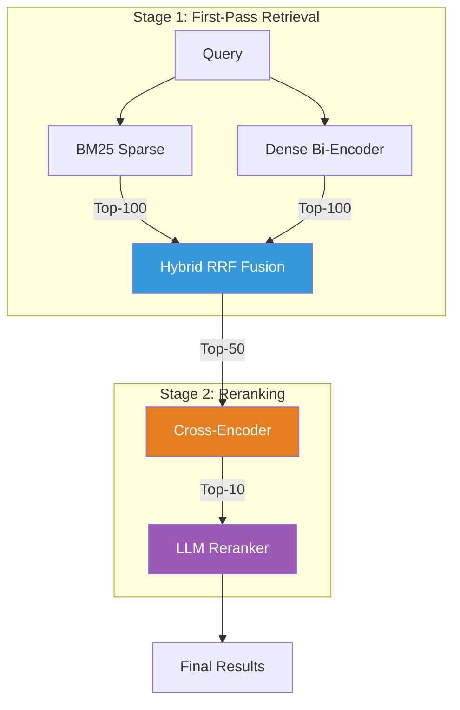

# Search Ranking Stack 🔍

> Hands-on demo: Build a modern search ranking stack from BM25 to LLM reranking, measuring NDCG@10 at every stage.


This repository accompanies the blog post *"Building a Modern Search Ranking Stack: From Embeddings to LLM-Powered Relevance"*. It walks through the 4-level maturity path on a real IR benchmark (SciFact), measuring improvement at every stage.

## Architecture



## Quick Start

```bash
# Clone & install
git clone https://github.com/slavadubrov/search-ranking-stack.git
cd search-ranking-stack
uv sync

# Download the SciFact dataset (~5K documents)
uv run download-data

# Run the full pipeline
uv run run-all
```

### LLM Reranking Options

Choose one of three LLM backends for Stage 3 reranking:

#### Option A: Ollama (Recommended for Local)

```bash
# Install Ollama: https://ollama.com/download
ollama pull qwen2.5:7b   # Best quality (4.4GB)
# OR: ollama pull llama3.2:3b  # Fastest (2GB)

uv run run-all
```

**Recommended models for ranking:**
| Model | Size | Quality | Command |
|-------|------|---------|---------|
| qwen2.5:7b | 4.4GB | Best | `ollama pull qwen2.5:7b` |
| llama3.2:3b | 2GB | Fast | `ollama pull llama3.2:3b` |
| mistral:7b | 4.1GB | Good | `ollama pull mistral:7b` |
| phi4:14b | 8.8GB | Excellent | `ollama pull phi4:14b` |

#### Option B: Claude API

```bash
# Copy and configure .env file
cp .env.example .env
# Edit .env and add your ANTHROPIC_API_KEY

uv sync --extra api
uv run run-all
```

#### Option C: Local HuggingFace Model

```bash
uv sync --extra llm
uv run run-all
```

### Configuration

All settings can be configured via `.env` file:

```bash
cp .env.example .env
```

Key variables:
- `ANTHROPIC_API_KEY` - Your Anthropic API key for Claude
- `OLLAMA_MODEL` - Ollama model name (default: `qwen2.5:7b`)
- `OLLAMA_BASE_URL` - Ollama server URL (default: `http://localhost:11434`)

## Benchmark Results

Results from running the full pipeline on SciFact (5,183 docs, 300 test queries):

| Stage | NDCG@10 | MRR@10 | Recall@100 |
|-------|---------|--------|------------|
| BM25 | 0.560 | 0.529 | 0.793 |
| Dense Bi-Encoder | 0.645 | 0.611 | 0.925 |
| Hybrid (RRF) | 0.639 | 0.613 | 0.929 |
| + Cross-Encoder | 0.623 | 0.614 | 0.929 |

## Key Insights

| Insight | Evidence |
|---------|----------|
| Hybrid search outperforms either method alone | RRF NDCG > max(BM25, Dense) |
| Cross-encoder reranking is the biggest ROI | Largest absolute NDCG jump at Stage 2 |
| LLM reranking adds marginal but visible gain | Small but consistent improvement on top-10 |
| Recall is set at retrieval | Recall@100 stays flat after Stage 1c |

## Stage-by-Stage Breakdown

### Stage 1a: BM25 Baseline

Lexical matching using the classic Okapi BM25 algorithm. Works well when query terms appear directly in documents. Uses `rank-bm25` library.

### Stage 1b: Dense Bi-Encoder

Semantic matching using `all-MiniLM-L6-v2`. Encodes queries and documents into 384-dim vectors. Finds conceptually similar documents even without keyword overlap.

### Stage 1c: Hybrid RRF Fusion

Combines BM25 and Dense results using Reciprocal Rank Fusion (k=60). Takes the best of both worlds—lexical precision and semantic recall.

### Stage 2: Cross-Encoder Reranking

Reranks top-50 candidates with `ms-marco-MiniLM-L-12-v2`. Cross-encoders score query-document pairs jointly, providing more accurate relevance estimates.

### Stage 3: LLM Listwise Reranking

(Optional) Uses an LLM to perform listwise comparison of top-10 results. Supports local Qwen2.5-1.5B or Claude API. Inspired by RankGPT.

## Dataset

Uses [BEIR/SciFact](https://huggingface.co/datasets/BeIR/scifact):

- **5,183** biomedical paper abstracts
- **300** test queries (scientific claims)
- Binary relevance labels

## Dependencies

Core:

- `datasets` - HuggingFace dataset loading
- `rank-bm25` - BM25 retrieval
- `sentence-transformers` - Bi-encoder and Cross-encoder
- `pytrec-eval-terrier` - IR metrics (NDCG, MRR, Recall)
- `matplotlib` - Visualization

Optional:

- `[llm]` - Local LLM reranking (transformers, torch, accelerate)
- `[api]` - Claude API reranking (anthropic)
- `[notebook]` - Jupyter notebooks
- `[dev]` - Development tools (ruff, pytest)

## References

- [Cormack et al. 2009](https://plg.uwaterloo.ca/~gvcormac/cormacksigir09-rrf.pdf) - Reciprocal Rank Fusion
- [RankGPT](https://arxiv.org/abs/2304.09542) - LLM Listwise Reranking
- [BEIR Benchmark](https://github.com/beir-cellar/beir) - Information Retrieval Evaluation
- [Sentence-Transformers](https://www.sbert.net/) - Neural Retrieval Models

## License

MIT
