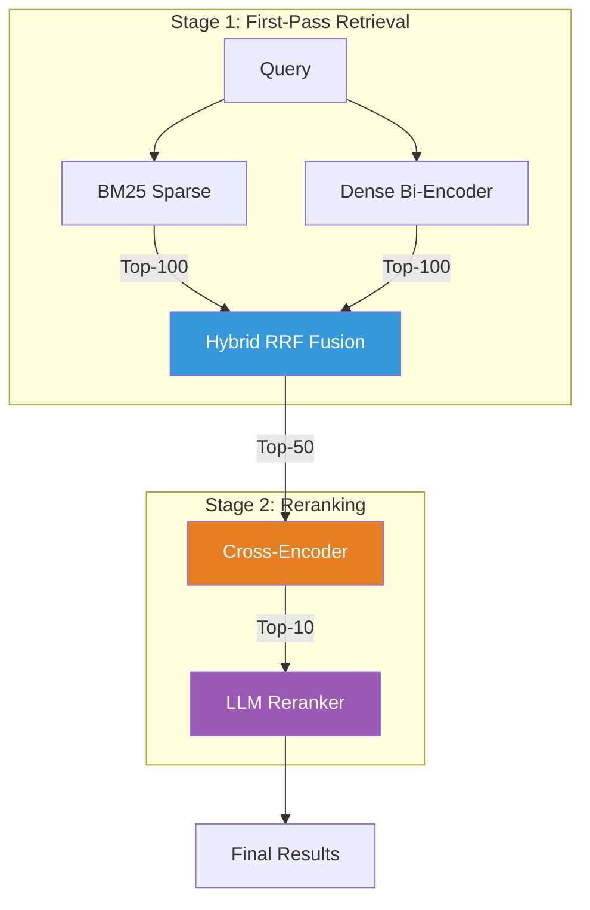

# Search Ranking Stack 🔍

> Hands-on demo: Build a modern search ranking stack from BM25 to LLM reranking, measuring NDCG@10 on the **Amazon ESCI product search benchmark**.


This repository accompanies the blog post *"Building a Modern Search Ranking Stack: From Embeddings to LLM-Powered Relevance"*. It walks through the 4-level maturity path on a real product search benchmark, measuring improvement at every stage.

## Why ESCI?

The [Amazon ESCI](https://github.com/amazon-science/esci-data) (Shopping Queries Dataset) is ideal for demonstrating search ranking because:

| Property | Value |
|----------|-------|
| **Domain** | Product search — directly relevant to e-commerce and classifieds |
| **Graded relevance** | 4 levels: Exact (E=3), Substitute (S=2), Complement (C=1), Irrelevant (I=0) |
| **Vocabulary mismatch** | Users describe *what they want* while listings describe *what the product is* |
| **Scale** | ~500 sampled queries, ~8.5K products, ~12K judgments (laptop-friendly subset) |
| **Credibility** | KDD Cup 2022 benchmark, published by Amazon Science |

**ESCI label mapping:**
- **Exact (E=3):** Product satisfies all query requirements
- **Substitute (S=2):** Functional alternative (close but not exact)
- **Complement (C=1):** Related item useful alongside exact match
- **Irrelevant (I=0):** No relevance to query intent

## Architecture



## Quick Start

```bash
# Clone & install
git clone https://github.com/slavadubrov/search-ranking-stack.git
cd search-ranking-stack
uv sync

# Download & sample ESCI dataset (~2.5GB download, ~5MB sample)
uv run download-data

# Run the full pipeline (without LLM reranking)
uv run run-all

# Run with LLM reranking (choose one)
uv run run-all --llm-mode ollama   # Ollama local model
uv run run-all --llm-mode api      # Claude API
uv run run-all --llm-mode local    # HuggingFace local model
```

### LLM Reranking Options

Use `--llm-mode` to enable Stage 3 LLM reranking:

#### Option A: Ollama (Recommended for Local)

```bash
# Install Ollama: https://ollama.com/download
ollama pull qwen2.5:7b   # Best quality (4.4GB)
# OR: ollama pull llama3.2:3b  # Fastest (2GB)

uv run run-all --llm-mode ollama
```

#### Option B: Claude API

```bash
cp .env.example .env
# Edit .env and add your ANTHROPIC_API_KEY

uv sync --extra api
uv run run-all --llm-mode api
```

## Expected Results

Results from running the full pipeline on Amazon ESCI (~500 queries):

| Stage | NDCG@10 | MRR@10 | Recall@100 |
|-------|---------|--------|------------|
| BM25 | ~0.47 | ~0.44 | ~0.78 |
| Dense Bi-Encoder | ~0.42 | ~0.39 | ~0.75 |
| Hybrid (RRF) | ~0.57 | ~0.54 | ~0.89 |
| + Cross-Encoder | ~0.67 | ~0.65 | ~0.89 |
| + LLM Reranker | ~0.72 | ~0.70 | ~0.89 |

> **Note:** Product search NDCG scores are lower than other IR benchmarks because vocabulary mismatch is more severe in e-commerce.


## Key Insights

| Insight | Evidence |
|---------|----------|
| Hybrid search outperforms either method alone | RRF NDCG > max(BM25, Dense) |
| Cross-encoder reranking is the biggest ROI | Largest absolute NDCG jump (~+10%) |
| LLM reranking adds marginal but visible gain | ~+5% improvement on top-10 |
| Recall is set at retrieval | Recall@100 stays flat after Stage 1c |
| Graded relevance reveals quality improvements | E/S/C/I distribution shows progression |

## Stage-by-Stage Breakdown

### Stage 1a: BM25 Baseline

Lexical matching using Okapi BM25. Works well on exact product names, fails on intent queries (vocabulary mismatch).

### Stage 1b: Dense Bi-Encoder

Semantic matching using `all-MiniLM-L6-v2`. Handles synonymy ("cheap laptop" → "budget notebook") but may miss specific SKUs.

### Stage 1c: Hybrid RRF Fusion

Combines BM25 and Dense results using Reciprocal Rank Fusion (k=60). Best of both worlds—lexical precision and semantic recall.

### Stage 2: Cross-Encoder Reranking

Reranks top-50 with `ms-marco-MiniLM-L-12-v2`. Distinguishes Exact from Substitute from Complement—the core product search challenge.

### Stage 3: LLM Listwise Reranking

(Optional) Uses an LLM for listwise comparison of top-10 results. Strongest on "reasoning-heavy" queries requiring domain knowledge.

## Dataset Citation

```bibtex
@article{reddy2022shopping,
  title={Shopping Queries Dataset: A Large-Scale {ESCI} Benchmark for Improving Product Search},
  author={Reddy, Chandan K. and Màrquez, Lluís and Valero, Fran and Rao, Nikhil and Zaragoza, Hugo and Bandyopadhyay, Sambaran and Biswas, Arnab and Xing, Anlu and Subbian, Karthik},
  journal={arXiv preprint arXiv:2206.06588},
  year={2022}
}
```

## References

- [Cormack et al. 2009](https://plg.uwaterloo.ca/~gvcormac/cormacksigir09-rrf.pdf) - Reciprocal Rank Fusion
- [RankGPT](https://arxiv.org/abs/2304.09542) - LLM Listwise Reranking
- [Amazon ESCI](https://github.com/amazon-science/esci-data) - Shopping Queries Dataset
- [Sentence-Transformers](https://www.sbert.net/) - Neural Retrieval Models

## License

MIT
