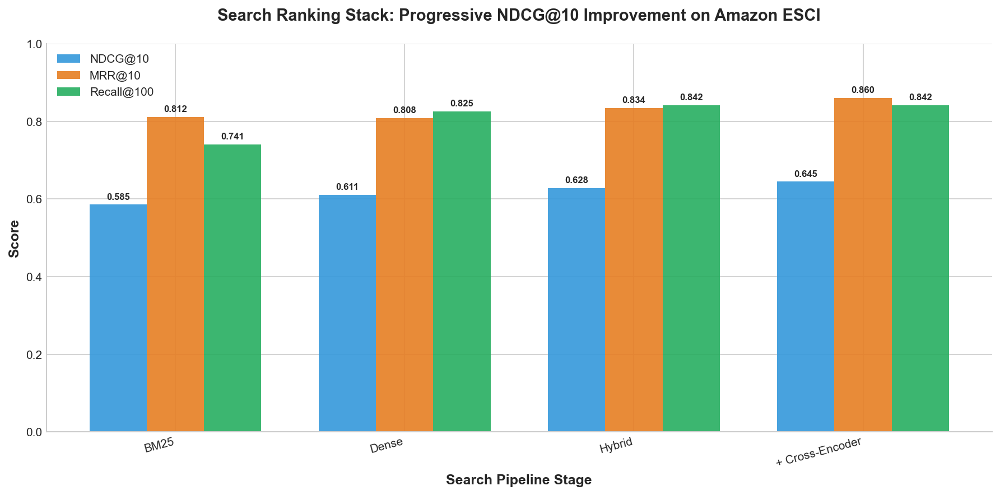
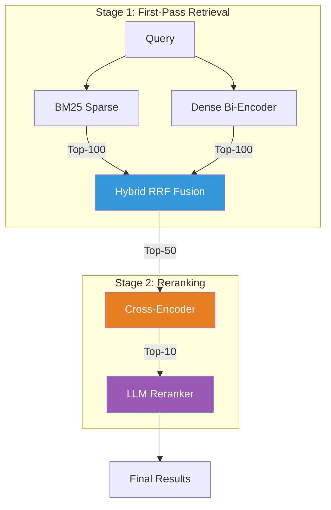
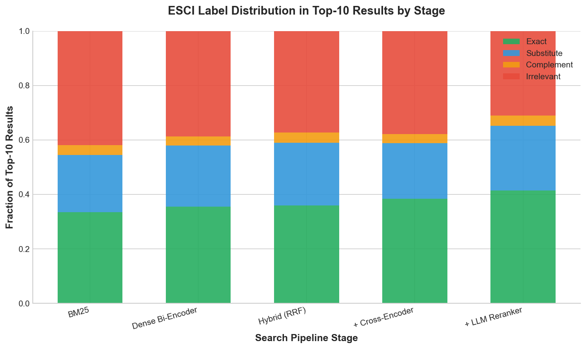

# Search Ranking Stack

> Build a modern search ranking stack from BM25 to LLM reranking, measuring NDCG@10 on the **Amazon ESCI product search benchmark**.



## Architecture



## Quick Start

```bash
# Clone & install
git clone https://github.com/slavadubrov/search-ranking-stack.git
cd search-ranking-stack
uv sync

# Download & sample ESCI dataset (~2.5GB download, ~5MB sample)
uv run download-data

# Run the full pipeline (without LLM reranking)
uv run run-all

# Run with LLM reranking (choose one)
uv run run-all --llm-mode ollama   # Ollama local model
uv run run-all --llm-mode api      # Claude API
uv run run-all --llm-mode local    # HuggingFace local model
```

### LLM Reranking Options

Use `--llm-mode` to enable Stage 3 LLM reranking:

#### Option A: Ollama (Recommended for Local)

```bash
# Install Ollama: https://ollama.com/download
ollama pull qwen2.5:7b   # Best quality (4.4GB)
# OR: ollama pull llama3.2:3b  # Fastest (2GB)

uv run run-all --llm-mode ollama
```

#### Option B: Claude API

```bash
cp .env.example .env
# Edit .env and add your ANTHROPIC_API_KEY

uv sync --extra api
uv run run-all --llm-mode api
```

## Results

Results from running the full pipeline on Amazon ESCI (~500 queries):

| Stage | NDCG@10 | MRR@10 | Recall@100 |
|-------|---------|--------|------------|
| BM25 | 0.585 | 0.812 | 0.741 |
| Dense Bi-Encoder | 0.611 | 0.808 | 0.825 |
| Hybrid (RRF) | 0.628 | 0.834 | 0.842 |
| + Cross-Encoder | 0.645 | 0.860 | 0.842 |
| + LLM Reranker | 0.717 | 0.901 | 0.842 |



## Documentation

| Doc | What You'll Learn |
|-----|-------------------|
| [Project Overview](docs/overview.md) | Architecture, key insights, project structure, how to experiment |
| [Dataset](docs/dataset.md) | ESCI dataset, graded relevance labels, sampling strategy |
| [Methods](docs/methods.md) | All 5 ranking methods — how they work, industry use, pros/cons |
| [Metrics](docs/metrics.md) | NDCG, MRR, Recall — formulas, worked examples, why each matters |

## References

- [Cormack et al. 2009](https://plg.uwaterloo.ca/~gvcormac/cormacksigir09-rrf.pdf) - Reciprocal Rank Fusion
- [RankGPT](https://arxiv.org/abs/2304.09542) - LLM Listwise Reranking
- [Amazon ESCI](https://github.com/amazon-science/esci-data) - Shopping Queries Dataset
- [Sentence-Transformers](https://www.sbert.net/) - Neural Retrieval Models

## License

MIT
