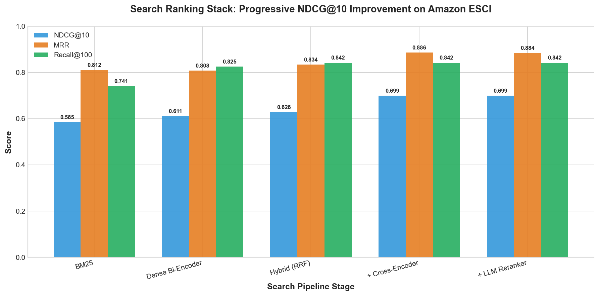
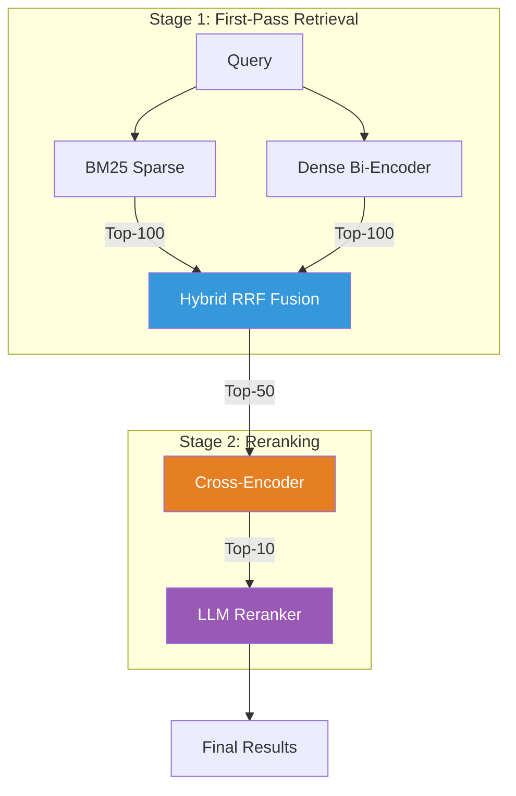
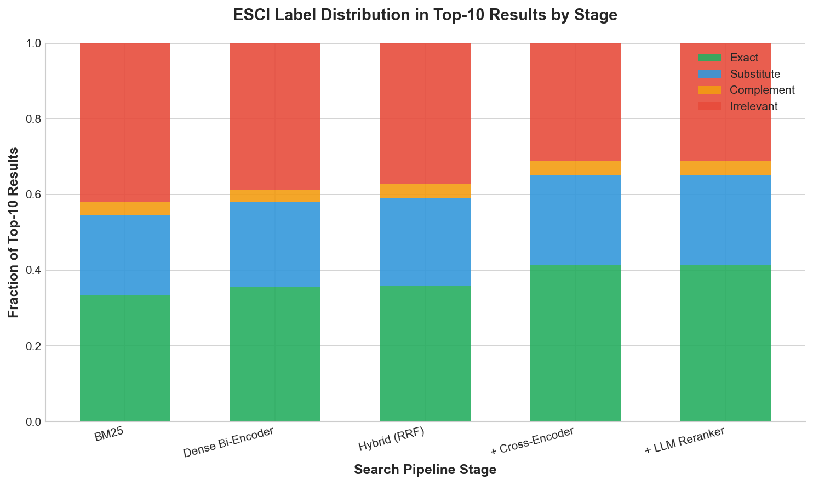

# Search Ranking Stack

> Build a modern search ranking stack from BM25 to LLM reranking, measuring NDCG@10 on the **Amazon ESCI product search benchmark**.



## Architecture


```mermaid
flowchart TB
    subgraph "Stage 1: First-Pass Retrieval"
        Q[Query] --> BM25[BM25 Sparse]
        Q --> Dense[Dense Bi-Encoder]
        BM25 --> |Top-100| RRF[Hybrid RRF Fusion]
        Dense --> |Top-100| RRF
    end

    subgraph "Stage 2: Reranking"
        RRF --> |Top-50| CE[Cross-Encoder]
        CE --> |Top-10| LLM[LLM Reranker]
    end

    LLM --> Results[Final Results]

    style RRF fill:#3498db,color:white
    style CE fill:#e67e22,color:white
    style LLM fill:#9b59b6,color:white
```

## Quick Start

```bash
# Clone & install
git clone https://github.com/slavadubrov/search-ranking-stack.git
cd search-ranking-stack
uv sync

# Download & sample ESCI dataset (~2.5GB download, ~5MB sample)
uv run download-data

# Run the full pipeline (without LLM reranking)
uv run run-all

# Run with LLM reranking (choose one)
uv run run-all --llm-mode ollama   # Ollama local model
uv run run-all --llm-mode api      # Claude API
uv sync --extra llm && uv run run-all --llm-mode local  # HuggingFace local model (needs accelerate)
```

### LLM Reranking Options

Use `--llm-mode` to enable Stage 3 LLM reranking:

#### Option A: Ollama (Recommended for Local)

```bash
# Install Ollama: https://ollama.com/download
ollama pull llama3.2:3b   # default model (2GB); set OLLAMA_MODEL in .env to use another

uv run run-all --llm-mode ollama
```

#### Option B: Claude API

```bash
cp .env.example .env
# Edit .env and add your ANTHROPIC_API_KEY

uv sync --extra api
uv run run-all --llm-mode api
```

#### Option C: Local HuggingFace model

`local` mode loads `Qwen/Qwen2.5-1.5B-Instruct` with `device_map="auto"`, which needs `accelerate`. Install the `llm` extra first:

```bash
uv sync --extra llm
uv run run-all --llm-mode local
```

## Results

Results from `uv run run-all --llm-mode ollama` on the ESCI sample (500 queries, 9,870 products, 9,984 judgments). The LLM stage used `llama3.2:3b` through Ollama; 67 of 500 answers (13.4%) failed the parser and kept the cross-encoder order.

| Stage | NDCG@10 | MRR | Recall@100 |
|-------|---------|-----|------------|
| BM25 | 0.585 | 0.812 | 0.741 |
| Dense Bi-Encoder | 0.611 | 0.808 | 0.825 |
| Hybrid (RRF) | 0.628 | 0.834 | 0.842 |
| + Cross-Encoder | 0.699 | 0.886 | 0.842 |
| + LLM Reranker (13.4% fallback) | 0.699 | 0.884 | 0.842 |

MRR counts a result as relevant when its ESCI gain is above 0 and is computed over each returned list of up to 100 results. The sample is not a held-out split; use it to reproduce the stages, not to choose a production model.



## Documentation

| Doc | What You'll Learn |
|-----|-------------------|
| [Project Overview](docs/overview.md) | Architecture, key insights, project structure, how to experiment |
| [Dataset](docs/dataset.md) | ESCI dataset, graded relevance labels, sampling strategy |
| [Methods](docs/methods.md) | All 5 ranking methods — how they work, industry use, pros/cons |
| [Metrics](docs/metrics.md) | NDCG, MRR, Recall — formulas, worked examples, why each matters |

## References

- [Cormack et al. 2009](https://plg.uwaterloo.ca/~gvcormac/cormacksigir09-rrf.pdf) - Reciprocal Rank Fusion
- [RankGPT](https://arxiv.org/abs/2304.09542) - LLM Listwise Reranking
- [Amazon ESCI](https://github.com/amazon-science/esci-data) - Shopping Queries Dataset
- [Sentence-Transformers](https://www.sbert.net/) - Neural Retrieval Models

## License

MIT
