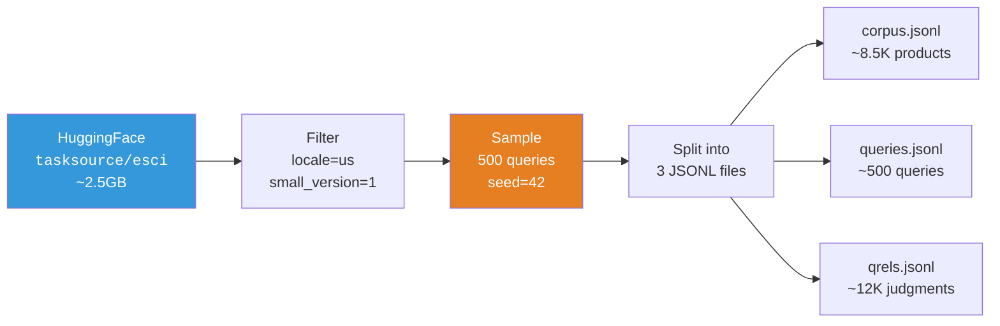

# The ESCI Dataset

A deep dive into the Amazon Shopping Queries Dataset — what it is, why we chose it, and how we sample it.

## What is ESCI?

ESCI (Exact, Substitute, Complement, Irrelevant) is the **Shopping Queries Dataset** released by [Amazon Science](https://github.com/amazon-science/esci-data) for the KDD Cup 2022 competition. It contains real product search queries paired with human-judged relevance labels across four granularity levels.

Unlike most IR benchmarks that use binary relevant/not-relevant labels, ESCI provides **graded relevance** that captures the nuance of product search: a "wireless mouse" query should rank an exact wireless mouse higher than a mouse pad (complement), even though both are technically "relevant."

## Why ESCI for This Project?

| Property | Value | Why It Matters |
|----------|-------|----------------|
| **Domain** | Product search | Directly relevant to e-commerce — the largest commercial search vertical |
| **Graded relevance** | 4 levels (E/S/C/I) | Lets us use NDCG, which distinguishes good rankings from great ones |
| **Vocabulary mismatch** | Severe | Users say "cheap laptop"; products say "budget notebook computer" — stress-tests semantic retrieval |
| **Scale** | ~500 sampled queries | Laptop-friendly, runs in minutes, yet statistically meaningful |
| **Credibility** | KDD Cup 2022 | Peer-reviewed benchmark used by hundreds of research teams |

## Graded Relevance Labels

The four ESCI labels represent a spectrum of relevance, not a binary split:

| Label | Gain | Meaning | Example (Query: "wireless bluetooth headphones") |
|-------|------|---------|--------------------------------------------------|
| **Exact (E)** | 3 | Product satisfies all query requirements | Sony WH-1000XM5 Wireless Bluetooth Headphones |
| **Substitute (S)** | 2 | Functional alternative — close but not exact | Wired headphones with Bluetooth adapter |
| **Complement (C)** | 1 | Related item useful alongside the exact match | Headphone carrying case |
| **Irrelevant (I)** | 0 | No meaningful relationship to the query | USB charging cable |

### Why Graded Relevance Matters

Binary relevance (relevant/not-relevant) can't distinguish these two rankings for "running shoes":

- **Ranking A:** Nike Running Shoe (E), Running Socks (C), Shoe Cleaner (C)
- **Ranking B:** Nike Running Shoe (E), Adidas Running Shoe (S), Brooks Running Shoe (S)

Both have 3 "relevant" results under binary evaluation. But Ranking B is clearly better for the user — NDCG with graded relevance captures this by giving Exact and Substitute higher gain values than Complement.

## Dataset Schema

### Original HuggingFace Source

We load from [`tasksource/esci`](https://huggingface.co/datasets/tasksource/esci), a pre-joined version that merges query-product pairs with product metadata. Key fields:

| Field | Description |
|-------|-------------|
| `query_id` | Unique query identifier |
| `query` | Search query text |
| `product_id` | ASIN (Amazon Standard Identification Number) |
| `product_title` | Product listing title |
| `product_brand` | Brand name |
| `product_bullet_point` | Key features |
| `product_description` | Full product description |
| `product_color` | Color attribute |
| `esci_label` | One of: Exact, Substitute, Complement, Irrelevant |
| `product_locale` | Country code (us, es, jp) |
| `small_version` | Flag for the "hard" subset |

### Sampled JSONL Files

After sampling, we produce three files in `data/esci_sample/`:

| File | Contents | Format |
|------|----------|--------|
| `corpus.jsonl` | Unique products with composite `product_text` | `{product_id, product_title, product_brand, ..., product_text}` |
| `queries.jsonl` | Unique queries | `{query_id, query}` |
| `qrels.jsonl` | Relevance judgments | `{query_id, product_id, relevance}` |

The `product_text` field concatenates title, brand, bullet points, and description (truncated to 500 chars) into a single searchable string.

## Sampling Strategy

We sample a laptop-friendly subset that's small enough to run in minutes but large enough for meaningful evaluation:

```
Target:    500 queries
Seed:      42 (reproducible)
Locale:    us (English only)
Filter:    small_version == 1 ("hard" queries)
Result:    ~500 queries, ~8.5K products, ~12K judgments
```

**Why "hard" queries?** The `small_version` flag in ESCI marks queries that are more challenging — typically ones with vocabulary mismatch, ambiguity, or many near-relevant products. These are more interesting for benchmarking because trivial queries don't differentiate ranking methods.

**Why 500 queries?** This gives statistically stable metric averages while keeping total runtime under 5 minutes on a laptop (without LLM reranking). More queries add diminishing returns to metric stability.

## Data Pipeline



## Data Loading

At runtime, the three JSONL files are loaded into an `ESCIData` dataclass:

```python
@dataclass
class ESCIData:
    corpus: dict[str, str]          # product_id → product_text
    corpus_meta: dict[str, dict]    # product_id → {title, brand, color, ...}
    queries: dict[str, str]         # query_id → query text
    qrels: dict[str, dict[str, int]]  # query_id → {product_id: graded_relevance}
```

See [`src/search_ranking_stack/data_loader.py`](../src/search_ranking_stack/data_loader.py) for the loader and [`src/search_ranking_stack/data/download.py`](../src/search_ranking_stack/data/download.py) for the sampling script.

## Citation

```bibtex
@article{reddy2022shopping,
  title={Shopping Queries Dataset: A Large-Scale {ESCI} Benchmark for Improving Product Search},
  author={Reddy, Chandan K. and Màrquez, Lluís and Valero, Fran and Rao, Nikhil and Zaragoza, Hugo and Bandyopadhyay, Sambaran and Biswas, Arnab and Xing, Anlu and Subbian, Karthik},
  journal={arXiv preprint arXiv:2206.06588},
  year={2022}
}
```

---

*Back to [README](../README.md) | See also: [Metrics](metrics.md) for how we evaluate on this dataset*
