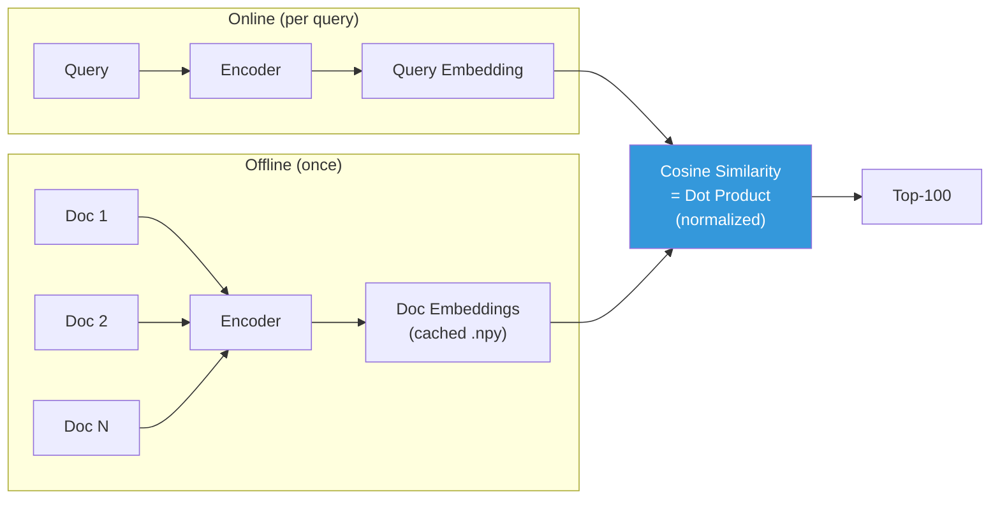
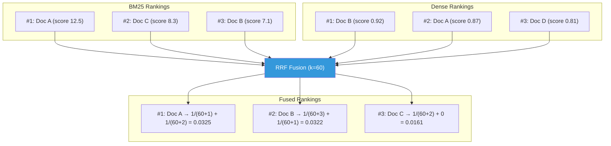
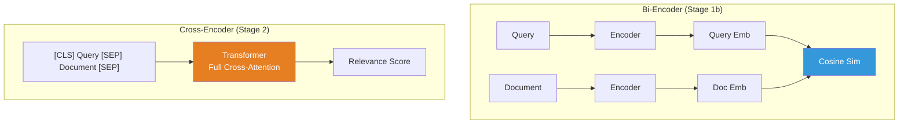

# Ranking Methods

A deep dive into the five ranking methods in this project — how each works, where it's used in industry, and how they compare.

## The Multi-Stage Search Paradigm

Modern search systems don't use a single model. They use a **cascade** of increasingly powerful (and expensive) models, each filtering fewer candidates:

```
8,500 products → [BM25/Dense] → 100 candidates → [RRF] → 100 → [Cross-Encoder] → 50 → [LLM] → 10
```

**Why cascade instead of using the best model on everything?**

A cross-encoder scoring all 8,500 products would take ~100 seconds per query. An LLM scoring all 8,500 would take hours and cost dollars. The cascade spends cheap compute to filter down to a manageable set, then applies expensive models only where they matter. This is the same pattern used at Google, Amazon, and every major search engine.

---

## Stage 1a: BM25 Sparse Retrieval

### How It Works

BM25 (Best Matching 25, specifically Okapi BM25) is a **lexical scoring function** that ranks documents by term overlap with the query. It's the modern successor to TF-IDF with two key improvements: **term frequency saturation** and **document length normalization**.

**Simplified formula:**

```
BM25(q, d) = Σ  IDF(t) · [ tf(t,d) · (k₁ + 1) ] / [ tf(t,d) + k₁ · (1 - b + b · |d|/avgdl) ]
             t∈q
```

Where:
- `tf(t,d)` — how many times term `t` appears in document `d`
- `IDF(t)` — inverse document frequency (rare terms score higher)
- `|d|/avgdl` — document length relative to average (long documents are penalized)
- `k₁ ≈ 1.5` — controls term frequency saturation
- `b ≈ 0.75` — controls length normalization

The key insight: the 6th occurrence of "wireless" in a document adds far less score than the 1st. This **saturation** prevents long, keyword-stuffed documents from dominating.

### Where It's Used in Industry

BM25 (or close variants) is the default first-stage retriever at Elasticsearch, Solr, Lucene, and virtually every search engine. It's the baseline that everything else is measured against.

### Strengths

- Extremely fast (inverted index lookup, no GPU needed)
- No training required — works out of the box on any corpus
- Excellent on exact-match queries ("iPhone 15 Pro Max 256GB")
- Interpretable — you can explain why a document matched

### Weaknesses

- Fails on vocabulary mismatch ("cheap laptop" won't match "budget notebook")
- No understanding of semantics, synonymy, or intent
- Can't handle typos or morphological variations without stemming

### Implementation

Uses [`rank_bm25.BM25Okapi`](https://github.com/dorianbrown/rank_bm25) with simple whitespace tokenization. Retrieves top-100 candidates per query.

Source: [`src/search_ranking_stack/stages/s01_bm25.py`](../src/search_ranking_stack/stages/s01_bm25.py)

---

## Stage 1b: Dense Bi-Encoder Retrieval

### How It Works

A bi-encoder maps queries and documents **independently** into a shared embedding space, then scores by cosine similarity. "Bi" because query and document are encoded by two separate forward passes (using the same model weights).



**Key property:** Because documents are encoded independently of the query, embeddings can be **precomputed and cached**. This makes retrieval fast — it's just a matrix multiplication at query time.

**Model used:** [`all-MiniLM-L6-v2`](https://huggingface.co/sentence-transformers/all-MiniLM-L6-v2) (22M parameters, 384-dim embeddings). Small enough to run on CPU, yet captures semantic similarity well.

### Where It's Used in Industry

Dense retrieval powers semantic search at most modern tech companies. Facebook (FAISS), Google (ScaNN), and Pinecone all provide vector similarity infrastructure for bi-encoder retrieval at scale.

### Strengths

- Handles vocabulary mismatch ("cheap laptop" matches "budget notebook")
- Captures semantic similarity and synonymy
- Embeddings are precomputed — query-time is just a dot product
- Works across languages when using multilingual models

### Weaknesses

- Requires training data (the model was pre-trained on NLI/STS data)
- Can miss exact keyword matches that BM25 catches (specific SKUs, brand names)
- Embedding space can "hallucinate" similarity between unrelated concepts
- Harder to debug — you can't inspect why two things are "similar"

### Implementation

Encodes corpus once and caches embeddings to `corpus_embeddings.npy`. Query embeddings are computed on-the-fly. Uses normalized embeddings so cosine similarity reduces to dot product.

Source: [`src/search_ranking_stack/stages/s02_dense.py`](../src/search_ranking_stack/stages/s02_dense.py)

---

## Stage 1c: Hybrid RRF Fusion

### How It Works

Reciprocal Rank Fusion (RRF) combines multiple ranked lists into one by converting **scores to ranks**, then summing inverse ranks. This is rank-based, not score-based, which makes it robust to different score scales.

**Formula:**

```
RRF_score(d) = Σ  1 / (k + rank(d, rᵢ))
               i
```

Where `k = 60` (from the original [Cormack et al. 2009](https://plg.uwaterloo.ca/~gvcormac/cormacksigir09-rrf.pdf) paper) and `rank(d, rᵢ)` is the position of document `d` in ranked list `rᵢ`.

**Why k=60?** The constant `k` controls how much weight is given to lower-ranked documents. A larger `k` makes the fusion more democratic (less sensitive to exact rank position). The value 60 was empirically shown to work well across many fusion scenarios.



**Why hybrid beats individuals:** BM25 and Dense retrieval have complementary failure modes. BM25 misses semantic matches; Dense misses exact keyword matches. RRF recovers documents that rank well in *either* system — documents only need to be good in one method to survive.

### Where It's Used in Industry

RRF is the standard fusion method at Elasticsearch (since 8.8), Vespa, and most hybrid search deployments. It's popular because it requires no training, has one tunable parameter, and consistently outperforms either retrieval method alone.

### Strengths

- No training needed — purely algorithmic
- Score-scale invariant (works even if BM25 scores are 0-20 and Dense scores are 0-1)
- Consistently improves over individual retrievers
- One parameter (`k`) that's robust to tuning

### Weaknesses

- Treats all input systems as equally trustworthy
- Can't learn that one retriever is better for certain query types
- Linear combination — no interaction between the two signal types

### Implementation

Takes BM25 and Dense result dicts, converts to ranks, applies RRF formula, returns top-100 fused results.

Source: [`src/search_ranking_stack/stages/s03_hybrid_rrf.py`](../src/search_ranking_stack/stages/s03_hybrid_rrf.py) | Config: `RRF_K = 60`

---

## Stage 2: Cross-Encoder Reranking

### How It Works

A cross-encoder processes the query and document **together** through a single transformer, with full cross-attention between all query and document tokens. This is fundamentally more powerful than a bi-encoder, which processes them independently.



**Why cross-attention matters:** In a bi-encoder, the query embedding of "apple" is the same regardless of whether the document says "Apple iPhone" or "apple fruit." A cross-encoder can attend to both simultaneously, resolving ambiguity in context.

**The trade-off:** Cross-encoders can't precompute document representations (each query-document pair requires a fresh forward pass). This makes them ~100x slower than bi-encoders, which is why we only run them on the top-50 candidates from hybrid retrieval.

**Model used:** [`ms-marco-MiniLM-L-12-v2`](https://huggingface.co/cross-encoder/ms-marco-MiniLM-L-12-v2) (33M parameters). Trained on MS MARCO passage ranking, transfers well to product search.

### Where It's Used in Industry

Cross-encoders are the industry standard for reranking. Cohere Rerank, Google's Vertex AI Search, and most production search systems use a cross-encoder (or similar architecture) as the primary reranker.

### Strengths

- Much more accurate than bi-encoders (full cross-attention)
- Distinguishes fine-grained relevance levels (Exact vs. Substitute)
- Pre-trained on large ranking datasets (MS MARCO)
- The biggest single-stage ROI jump in most search pipelines

### Weaknesses

- Cannot precompute — O(queries × candidates) forward passes
- Too slow for full corpus search (only viable as a reranker)
- Still limited by model size and training data domain

### Implementation

Reranks top-50 hybrid candidates per query. Truncates document text to ~512 tokens. Unreranked documents beyond position 50 are retained with penalized scores.

Source: [`src/search_ranking_stack/stages/s04_cross_encoder.py`](../src/search_ranking_stack/stages/s04_cross_encoder.py) | Config: `TOP_K_RERANK_CE = 50`

---

## Stage 3: LLM Listwise Reranking

### How It Works

Instead of scoring each document independently, the LLM sees **all top-10 results at once** and outputs a complete ranking. This is the **listwise** approach (inspired by [RankGPT](https://arxiv.org/abs/2304.09542)), which can compare products against each other — something pointwise models can't do.

**Prompt template (simplified):**

```
I will provide you with 10 product listings, each indicated by [1] to [10].
Rank the products based on their relevance to the search query: "wireless headphones"

Consider:
- Exact matches should rank highest
- Substitutes should rank above complements
- Irrelevant products should rank lowest

[1] Sony WH-1000XM5 Wireless Bluetooth Headphones...
[2] Headphone Stand Holder...
...

Output ONLY a comma-separated list: [3], [1], [2], ...
```

**Three modes:**

| Mode | Model | How It Runs |
|------|-------|-------------|
| `ollama` | `llama3.2:3b` (default, configurable) | Local via Ollama API |
| `api` | `claude-haiku-4-5-20251001` | Anthropic API |
| `local` | `Qwen/Qwen2.5-1.5B-Instruct` | HuggingFace Transformers |

**Fallback logic:** If the LLM output can't be parsed (missing bracket numbers, wrong count), the system falls back to the cross-encoder ordering. Partial outputs are padded with remaining positions in original order.

### Where It's Used in Industry

LLM reranking is the newest technique, used at the frontier of search quality. Microsoft Bing uses GPT-based reranking, and several startups (Cohere, Jina) are building LLM reranking as a service. It's most valuable for queries requiring domain knowledge or complex reasoning.

### Strengths

- Can reason about product relevance using world knowledge
- Handles nuanced queries ("laptop for video editing under $1000")
- Listwise comparison enables relative judgments between candidates
- Zero-shot — no fine-tuning needed for new domains

### Weaknesses

- Slowest and most expensive stage (seconds per query, API costs)
- Non-deterministic — different runs may produce different rankings
- Parsing failures require fallback logic
- Limited context window constrains number of candidates

### Implementation

Takes top-10 cross-encoder results, formats a listwise prompt, parses the LLM response into a reordered ranking. Three backend modes share the same prompt construction and parsing logic.

Source: [`src/search_ranking_stack/stages/s05_llm_rerank.py`](../src/search_ranking_stack/stages/s05_llm_rerank.py) | Config: `TOP_K_RERANK_LLM = 10`

---

## Method Comparison

| Method | Type | Approach | Candidates In | Candidates Out | Training Needed | Primary Strength | Primary Weakness |
|--------|------|----------|---------------|----------------|-----------------|------------------|------------------|
| BM25 | Retrieval | Lexical (term matching) | 8,500 | 100 | None | Exact keyword match | Vocabulary mismatch |
| Dense Bi-Encoder | Retrieval | Semantic (embeddings) | 8,500 | 100 | Pre-trained | Semantic similarity | Misses exact terms |
| Hybrid RRF | Fusion | Rank combination | 200 (2×100) | 100 | None | Best of both worlds | Can't learn preferences |
| Cross-Encoder | Reranking | Cross-attention | 50 | 50 | Pre-trained | Fine-grained relevance | Too slow for full corpus |
| LLM Reranker | Reranking | Listwise reasoning | 10 | 10 | None (zero-shot) | Complex reasoning | Slow, expensive, non-deterministic |

### Results on ESCI

| Stage | NDCG@10 | MRR@10 | Recall@100 | NDCG@10 Delta |
|-------|---------|--------|------------|---------------|
| BM25 | 0.585 | 0.812 | 0.741 | — |
| Dense Bi-Encoder | 0.611 | 0.808 | 0.825 | +0.026 |
| Hybrid (RRF) | 0.628 | 0.834 | 0.842 | +0.017 |
| + Cross-Encoder | 0.645 | 0.860 | 0.842 | +0.017 |
| + LLM Reranker | 0.717 | 0.901 | 0.842 | +0.072 |

---

*Back to [README](../README.md) | See also: [Metrics](metrics.md) for how these numbers are computed, [Dataset](dataset.md) for what we're evaluating on*
