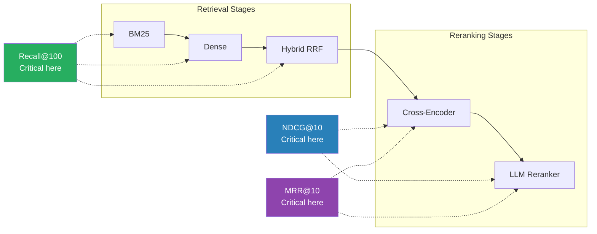

# Evaluation Metrics

How we measure search quality — and why these three metrics tell the full story.

## Why Measurement Matters

A ranking system that "feels better" isn't enough. Each stage in the pipeline must prove its value with numbers. We use three complementary metrics that together capture **ranking quality** (NDCG@10), **user experience** (MRR@10), and **retrieval coverage** (Recall@100).

## Metrics Used

### NDCG@10 — Normalized Discounted Cumulative Gain (Primary)

**What it measures:** How well the top-10 results are ordered, giving more credit to highly relevant documents placed near the top.

**Why it's the primary metric:** NDCG is the only metric here that fully exploits ESCI's 4-level graded relevance (E=3, S=2, C=1, I=0). A system that places an Exact match at position 1 scores higher than one that places a Substitute there — binary metrics can't distinguish these.

**Formula:**

```
DCG@k  = Σᵢ₌₁ᵏ  (2^relᵢ - 1) / log₂(i + 1)

NDCG@k = DCG@k / IDCG@k
```

Where `relᵢ` is the relevance of the document at position `i`, and `IDCG@k` is the DCG of the ideal (perfect) ranking.

**Worked example:**

Query: "wireless bluetooth headphones"

| Position | Product | ESCI Label | Gain (2^rel - 1) | Discount (1/log₂(i+1)) | Contribution |
|----------|---------|------------|-------------------|--------------------------|--------------|
| 1 | Sony WH-1000XM5 Wireless | Exact (3) | 7 | 1.000 | 7.000 |
| 2 | JBL Tune Bluetooth Earbuds | Substitute (2) | 3 | 0.631 | 1.893 |
| 3 | Headphone Stand | Complement (1) | 1 | 0.500 | 0.500 |

DCG@3 = 7.000 + 1.893 + 0.500 = **9.393**

Ideal ordering (E, E, S) → IDCG@3 = 7.000 + 4.416 + 1.500 = **12.916**

NDCG@3 = 9.393 / 12.916 = **0.727**

---

### MRR@10 — Mean Reciprocal Rank

**What it measures:** How quickly the user finds the first relevant result. Answers: "How far does the user have to scroll?"

**Why it matters:** Even if NDCG is high, users care most about the *first* good result. MRR captures this "time to satisfaction" signal.

**Formula:**

```
RR(q) = 1 / rank_of_first_relevant_result

MRR   = (1/|Q|) Σ RR(q)
```

A relevant result at position 1 gives RR=1.0, at position 3 gives RR=0.333, and no relevant result in top-10 gives RR=0.

**Worked example:**

| Query | First relevant position | RR |
|-------|------------------------|----|
| "wireless headphones" | 1 | 1.000 |
| "organic dog treats" | 3 | 0.333 |
| "usb-c hub adapter" | 1 | 1.000 |

MRR = (1.000 + 0.333 + 1.000) / 3 = **0.778**

> **Note:** In our evaluation, we treat any document with relevance > 0 (Complement or higher) as "relevant" for MRR. This means even a Complement match at position 1 yields RR=1.0.

---

### Recall@100 — Retrieval Coverage

**What it measures:** What fraction of all relevant documents appear somewhere in the top-100 results. This is a ceiling metric — if a relevant document isn't retrieved, no reranker can fix it.

**Why it matters:** Recall tells us whether the retrieval stage is doing its job. Rerankers can reorder but never add documents. That's why Recall@100 stays flat after Stage 1c in our results.

**Formula:**

```
Recall@k(q) = |relevant docs in top-k| / |all relevant docs for q|

Recall@k    = (1/|Q|) Σ Recall@k(q)
```

**Worked example:**

Query has 8 relevant documents total. Top-100 retrieval finds 6 of them.

Recall@100 = 6 / 8 = **0.75**

---

## Metric-to-Stage Mapping

Different metrics matter at different stages. Retrieval stages should maximize recall (get all relevant documents into the pool). Reranking stages should maximize NDCG and MRR (put the best documents on top).



**Key observation from our results:**

| Stage | NDCG@10 | MRR@10 | Recall@100 |
|-------|---------|--------|------------|
| BM25 | 0.585 | 0.812 | 0.741 |
| Dense Bi-Encoder | 0.611 | 0.808 | 0.825 |
| Hybrid (RRF) | 0.628 | 0.834 | 0.842 |
| + Cross-Encoder | 0.645 | 0.860 | 0.842 |
| + LLM Reranker | 0.717 | 0.901 | 0.842 |

Recall@100 jumps from 0.741 → 0.842 across retrieval stages, then **stays at 0.842** through both reranking stages. This confirms the fundamental rule: retrieval sets the ceiling, reranking optimizes within it.

---

## Metrics Not Used (and Why)

| Metric | What It Does | Why We Didn't Use It |
|--------|-------------|---------------------|
| **Precision@k** | Fraction of top-k that are relevant | Binary — doesn't distinguish Exact from Substitute |
| **MAP** (Mean Average Precision) | Average precision at each relevant hit | Binary relevance; NDCG is the graded generalization |
| **ERR** (Expected Reciprocal Rank) | Cascade model — user stops after finding good result | More complex than MRR with similar insights for our use case |
| **Hit Rate** (Hit@k) | Whether *any* relevant doc is in top-k | Too coarse — MRR is strictly more informative |

The common theme: our dataset has **graded relevance**, so we chose metrics that exploit it. Binary metrics throw away information that distinguishes a great ranking from a merely adequate one.

---

## Implementation

Metrics are computed using [`pytrec_eval`](https://github.com/cvangysel/pytrec_eval), the Python binding for the standard TREC evaluation toolkit used in academic IR research.

See [`src/search_ranking_stack/evaluate.py`](../src/search_ranking_stack/evaluate.py) for the implementation. The configured metrics in [`config.py`](../src/search_ranking_stack/config.py):

```python
EVAL_METRICS = {"ndcg_cut_10", "recip_rank", "recall_100"}
```

---

*Back to [README](../README.md) | See also: [Methods](methods.md) for how each stage optimizes these metrics*
