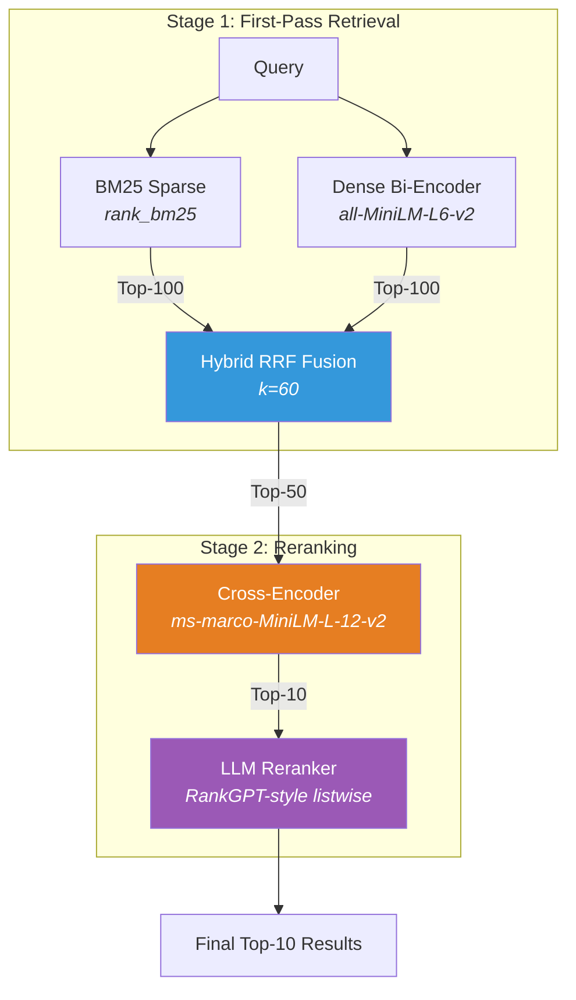
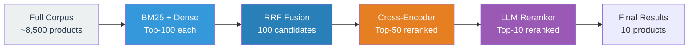

# Project Overview

Build a modern search ranking stack from BM25 to LLM reranking, measuring improvement at every stage on the Amazon ESCI product search benchmark.

## What This Project Does

This project implements a **5-stage search ranking pipeline** and benchmarks each stage on a real product search dataset. It demonstrates the industry-standard approach to search: start with fast, cheap retrieval methods, then progressively apply more expensive models to fewer candidates.

**Why it matters:** Most search tutorials show a single model in isolation. Real search systems use multiple models in a cascade. This project shows how each stage contributes — and proves it with metrics.

## Architecture



## The Retrieval-Reranking Funnel

Each stage narrows the candidate set while improving precision:



**Why this funnel shape?** Cost and latency increase dramatically at each stage. BM25 scores 8,500 documents in milliseconds. The cross-encoder takes ~100ms per query on 50 candidates. The LLM takes seconds on 10 candidates. By filtering aggressively, we get the best model's quality at a fraction of the cost.

## Key Insights

Results from running the full pipeline on Amazon ESCI (~500 queries):

| Stage | NDCG@10 | MRR@10 | Recall@100 |
|-------|---------|--------|------------|
| BM25 | 0.585 | 0.812 | 0.741 |
| Dense Bi-Encoder | 0.611 | 0.808 | 0.825 |
| Hybrid (RRF) | 0.628 | 0.834 | 0.842 |
| + Cross-Encoder | 0.645 | 0.860 | 0.842 |
| + LLM Reranker | 0.717 | 0.901 | 0.842 |

| Insight | Evidence |
|---------|----------|
| **Hybrid search outperforms either method alone** | RRF NDCG (0.628) > max(BM25 0.585, Dense 0.611) |
| **Dense beats BM25 on this dataset** | Dense NDCG 0.611 vs BM25 0.585 — semantic matching helps with product search vocabulary mismatch |
| **Recall is set at retrieval** | Recall@100 stays at 0.842 through both reranking stages |
| **LLM reranking provides the largest single jump** | +0.072 NDCG@10 from cross-encoder to LLM reranker |
| **Graded relevance reveals quality differences** | Label distribution plots show progression from Complement to Exact in top positions |

## Project Structure

```
search-ranking-stack/
├── src/search_ranking_stack/
│   ├── config.py                    # All hyperparameters and model names
│   ├── data_loader.py               # ESCIData schema and JSONL loading
│   ├── evaluate.py                  # NDCG, MRR, Recall via pytrec_eval
│   ├── data/
│   │   └── download.py              # HuggingFace download and sampling
│   └── stages/
│       ├── s01_bm25.py              # BM25 sparse retrieval
│       ├── s02_dense.py             # Dense bi-encoder retrieval
│       ├── s03_hybrid_rrf.py        # Reciprocal Rank Fusion
│       ├── s04_cross_encoder.py     # Cross-encoder reranking
│       └── s05_llm_rerank.py        # LLM listwise reranking
├── data/esci_sample/                # Downloaded dataset (gitignored)
├── results/
│   ├── metrics.json                 # Benchmark numbers
│   ├── metrics_comparison.png       # NDCG/MRR/Recall bar chart
│   └── label_distribution.png       # ESCI label distribution per stage
└── docs/                            # You are here
    ├── overview.md
    ├── dataset.md
    ├── methods.md
    └── metrics.md
```

## How to Use This for Learning

1. **Read the docs in order:** [Dataset](dataset.md) → [Methods](methods.md) → [Metrics](metrics.md)
2. **Run the pipeline:** `uv sync && uv run download-data && uv run run-all`
3. **Read the stage files** in order (`s01` through `s05`) — each is self-contained with docstrings explaining the approach
4. **Modify and experiment:**
   - Change `TOP_K_RETRIEVAL` in `config.py` to see how candidate pool size affects recall
   - Swap `BI_ENCODER_MODEL` for a larger model to see if dense retrieval improves
   - Adjust `RRF_K` to see how fusion sensitivity changes
   - Try different LLM models via `--llm-mode` to compare reranking quality

---

*Back to [README](../README.md) | Docs: [Dataset](dataset.md) | [Methods](methods.md) | [Metrics](metrics.md)*
